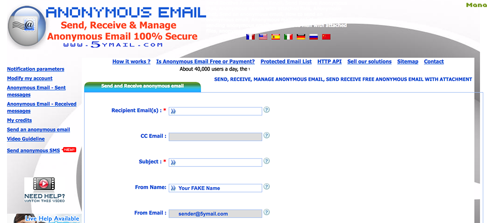
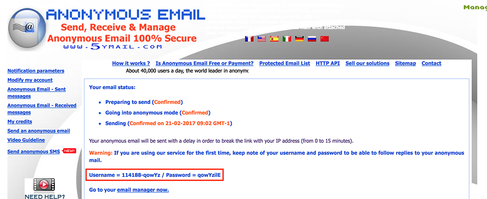
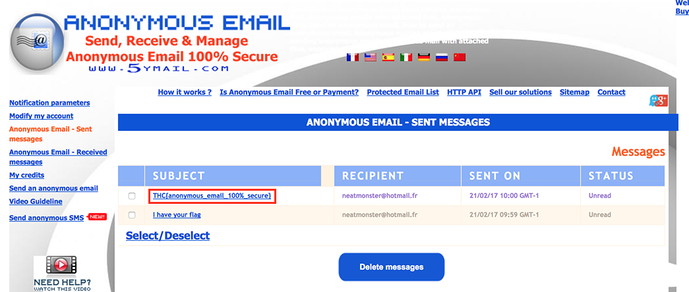

# Write-up

Ce challenge est particulièrement court, mais il s'agit d'avoir les bons réflexes.

Tout commence avec un fichier `challenge.eml` contenant l'e-mail suivant (tronqué) :

```
Date: Tue, 21 Feb 2017 09:59:05 -0700
To: <neatmonster@hotmail.fr>
From: Bad Guy <sender@5ymail.com>
Subject: I have your flag

Your precious flag has been kidnapped! You have 12 hours to recover it.
```

Si l'on s'arrête à ces informations, à priori rien de probant. On peut toutefois remarquer le domaine `5ymail.com` utilisé pour envoyer l'e-mail. Ouvrons le site dans notre navigateur pour voir de quoi il en retourne.



Il s'agit d'un service d'envoi d'e-mails anonymes "100% sécurisé". Toujours curieux, nous pouvons nous envoyer un e-mail pour tester.



Une fois l'e-mail envoyé, nous tombons sur cette page qui nous donne des identifiants nous permettant de nous connecter pour consulter le statut de l'e-mail, ainsi que les réponses à ce dernier. Dans le cas présent, il s'agit de `114188-qowYz:qowYzilE`.

Nous pouvons ensuite jeter un coup d'oeil à la boîte à laquelle nous avons envoyé l'e-mail, et s'intéresser à sa source.

```
Date: Tue, 21 Feb 2017 09:02:55 -0700
Return-Path: sender@5ymail.com
To: <neatmonster@hotmail.fr>
From: Your FAKE Name <sender@5ymail.com>
Reply-To: Your FAKE Name
    <Your_FAKE_Name.qowYzilE1y252985-114188-EN@5ymail.com>
Subject: test
Message-ID: <d5d2855c7f9524b6e7211e7acc25bd29@BlackBerry-System>

Type your anonymous message here
```

On remarque, en particulier si l'on recherche dans la source les identifants précédents, que ces derniers sont présents dans le champ `Reply-To:` qui vaut dans le cas présent `Your_FAKE_Name.qowYzilE1y252985-114188-EN@5ymail.com`.

En appliquant la même transformation pour notre premier e-mail, on obtient les identifants `114196-nUWAQ:nUWAQuXA`. En s'identifiant sur le site et en se rendant dans la rubrique `Anonymous Email - Received messages`, on découvre le drapeau tant recherché.



