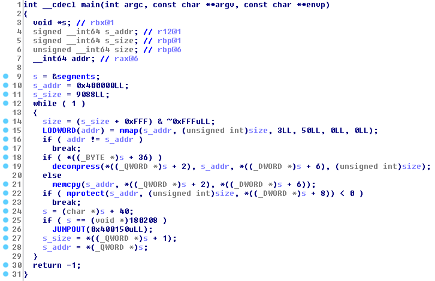
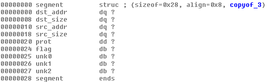
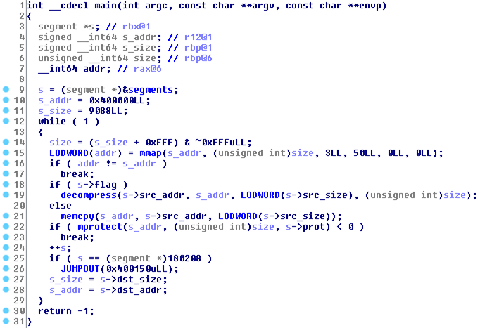
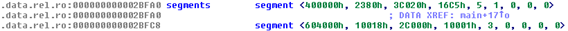
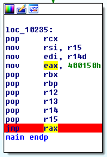
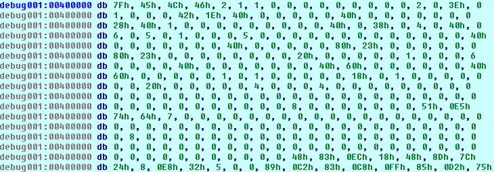
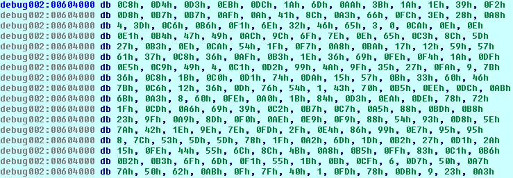

# Write-up

### Préliminaires

Le challenge commence avec un fichier `unpack` que l'on s'empresse de passer à la commande `file`.

```bash
$ file unpack
unpack: ELF 64-bit LSB executable, x86-64, version 1 (SYSV), statically linked, stripped
```

Il s'agit donc d'un exécutable *x86-64*, que l'on va donc pouvoir lancer assez simplement.

```bash
$ ./unpack 
:: Please enter the decryption key: AAAA
:: Wrong key format!
```

Le programme semble attendre une clé de déchiffrement dont le format est pour l'instant inconnu. Pour obtenir plus d'informations, on peut utiliser la commande `strace` pour obtenir la liste des appels système.

```bash
$ strace ./unpack
execve("./unpack", ["./unpack"], [/* 68 vars */]) = 0
mmap(0x400000, 12288, PROT_READ|PROT_WRITE, MAP_PRIVATE|MAP_FIXED|MAP_ANONYMOUS, 0, 0) = 0x400000
mprotect(0x400000, 12288, PROT_READ|PROT_EXEC) = 0
mmap(0x604000, 69632, PROT_READ|PROT_WRITE, MAP_PRIVATE|MAP_FIXED|MAP_ANONYMOUS, 0, 0) = 0x604000
mprotect(0x604000, 69632, PROT_READ|PROT_WRITE) = 0
mmap(NULL, 2284, PROT_READ|PROT_WRITE, MAP_PRIVATE|MAP_ANONYMOUS, 0, 0) = 0x7fe6fe105000
mmap(NULL, 65540, PROT_READ|PROT_WRITE, MAP_PRIVATE|MAP_ANONYMOUS, 0, 0) = 0x7fe6fe0f4000
mmap(NULL, 2052, PROT_READ|PROT_WRITE, MAP_PRIVATE|MAP_ANONYMOUS, 0, 0) = 0x7fe6fe0f3000
mmap(NULL, 40, PROT_READ|PROT_WRITE, MAP_PRIVATE|MAP_ANONYMOUS, 0, 0) = 0x7fe6fe0f2000
write(1, ":: Please enter the decryption k"..., 36:: Please enter the decryption key: ) = 36
mmap(NULL, 20, PROT_READ|PROT_WRITE, MAP_PRIVATE|MAP_ANONYMOUS, 0, 0) = 0x7fe6fe0f1000
read(0, AAAA
"AAAA\n", 16)                   = 5
mmap(NULL, 25, PROT_READ|PROT_WRITE, MAP_PRIVATE|MAP_ANONYMOUS, 0, 0) = 0x7fe6fe0f0000
write(1, ":: Wrong key format!\n", 21:: Wrong key format!
)  = 21
exit(0)                                 = ?
+++ exited with 0 +++
```

On remarque qu'après avoir affiché la chaîne `Please enter the descryption key`, le programme fait un appel système à la fonction `read` avec une longueur de 16 caractères. On peut donc tester avec une nouvelle clé de la bonne longueur.

```bash
$ ./unpack
:: Please enter the decryption key: AAAAAAAAAAAAAAAA
:: Trying to decrypt payload...
:: Invalid padding!
```

Un message différent est affiché, notre déduction est correcte. Mais pour aller plus loin, il est nécessaire de faire de l'analyse statique.

On remarque dans la sortie de `strace` que le binaire commence par faire deux appels à `mmap` puis `mprotect` pour mapper :

- une zone mémoire en lecture et exécution de 16 384 octets à l'adresse 0x400000 ;
- une zone mémoire en lecture et écriture de 69 632 octets à l'adresse 0x604000.

De plus, avec le nom du binaire, on peut supposer que ce binaire est chargé d'extraire le code et les données d'un autre binaire.

### Analyse de `unpack`

Pour vérifier nos hypothèses, on peut ouvrir le binaire dans IDA Pro. Un peu de *reverse engineering* est nécessaire sur les quelques fonctions du binaire, mais nous assez facilement permet d'identifier la fonction `main` et ses variables.



On constate que cette fonction alloue, protège et remplie des zones mémoire. Les données sont soit copiées, soit décompressées, vers ces nouvelles zones mémoire. Enfin, la fonction termine son exécution en sautant vers l'adresse 0x400150.

Les différents décalages par rapport à la variable `s` nous laissent penser qu'il s'agit d'un pointeur de structure. En prêtant attention aux décalages, conversions de types et utilisation des variables, on peut en conclure que la structure est similaire à celle ci-dessous.



La structure comporte un entier sur 8 octets donnant l'adresse de destination, un entier sur 8 octets donnant la taille de la destination, un entier sur 8 octets donnant l'adresse source, un entier sur 8 octets donnant la taille de la source,  un entier sur 4 octets représentant les drapeaux de l'appel à `mprotect`, et enfin un entier sur 1 octet déterminant quelle fonction appeler pour copier les données.



En définisant le type de la variable `s` comme de la structure nouvellement définie, on obtient un code un peu plus lisible. On peut maintenant essayer d'aller voir la variable `segments` qui semble contenir les informations sur les différents segments.



En indiquant le bon type des données, on obtient des valeurs pour deux segments qui semblent correctes. On constate que l'adresse vers laquelle le programme saute est située dans le premier segment. Nos hypothèses se vérifient petit à petit.

### Extraction de `mipsvm`

Pour continuer l'analyse, nous allons toutefois avoir besoin de récupérer ces données. Pour cela, nous allons utiliser le débogueur et définir un point d'arrêt juste avant le saut. Cela nous permettra de récupérer directement les données décompressées.



Une fois le programme lancé, on commence par se rendre à l'adresse 0x400000. En indiquant qu'il s'agit d'un tableau de 0x2380 octets, on peut ensuite récupérer les données vers un fichier `seg_data` grâce à la fonction *Export data* d'IDA Pro.



On fait de même pour les données situées à l'adresse 0x604000 de taille 0x10018 qui seront écrites dans `seg_data`.



Comme au début de ce challenge, on peut passer nos deux nouveaux binaires à la commande `file`.

```bash
$ file seg_code
seg_code: ERROR: ELF 64-bit LSB executable, x86-64, version 1 (SYSV), statically linked error reading (Invalid argument)
$ file seg_data
seg_data: data
```

Il apparaît que le premier binaire est un exécutable *x86-64* mais que son *header ELF* est endommagé. Le deuxième semble être des données brutes. Nous pouvons essayer de lancer le premier binaire comme précédemment.

```bash
$ ./seg_code
Invalid instruction.
```

Le programme fonctionne, mais il doit certainement lui manquer les données. Il va nous falloir recoller les deux morceaux. Pour ce faire, nous allons d'abord commencer par afficher le contenu lisible du *header ELF* à l'aide de la commande `readelf`.

```bash
$ readelf -l seg_code
readelf: Error: Reading 0x180 bytes extends past end of file for section headers

Elf file type is EXEC (Executable file)
Entry point 0x401e42
There are 4 program headers, starting at offset 64

Program Headers:
  Type           Offset             VirtAddr           PhysAddr
                 FileSiz            MemSiz              Flags  Align
  LOAD           0x0000000000000000 0x0000000000400000 0x0000000000400000
                 0x0000000000002380 0x0000000000002380  R E    200000
  LOAD           0x0000000000004000 0x0000000000604000 0x0000000000604000
                 0x0000000000010001 0x0000000000010018  RW     200000
  NOTE           0x0000000000000000 0x0000000000000000 0x0000000000000000
                 0x0000000000000000 0x0000000000000000  R      8
  GNU_STACK      0x0000000000000000 0x0000000000000000 0x0000000000000000
                 0x0000000000000000 0x0000000000000000  RWE    8
```
                 
On retrouve deux segments chargeables en mémoire aux adresses virtuelles 0x400000 et 0x604000, et normalement situés aux décalages 0x0 et 0x4000 dans le fichier binaire. Nous allons essayer de les y replacer à l'aide des commandes ci-dessous.

```bash
$ cp seg_code seg_new
$ dd if=/dev/zero of=seg_new bs=1 count=1 seek=16383
1+0 records in
1+0 records out
1 byte copied, 0,000589316 s, 1,7 kB/s
$ cat seg_new seg_data > seg_all
```

Si l'opération a fonctionné, on devrait retrouver la même sortie qu'au départ lorsque nous lançons le binaire `seg_all`.

```bash
$ ./seg_all
:: Please enter the decryption key: AAAA
:: Wrong key format!
```

Parfait. Il faut maintenant continuer notre analyse en nous intéressant à ce nouveau binaire. On peut le charger dans IDA Pro.

### Fonction `main`

Le rétro-conception de la fonction `main` est reportée ci-dessous.

```c
__int64 main()
{
  int res1; // edx@1
  __int64 res2; // rax@1
  vm_state_t *vm_state; // [sp+8h] [bp-10h]@1

  res1 = vm_init(&vm_state);
  result = 0xFFFFFFFFLL;
  if ( !res1 )
    res2 = vm_start(vm_state);
  return res2;
}
```

Elle fait d'abord appel à la fonction d'initialisation étudiée ci-dessous, puis à une fonction principale qui demandera la clé à l'utilisateur.

### Fonction `vm_init`

Le fonction d'intialisation permet de retrouver la structure de données utilisée pour le programme pour stocker l'état de la machine virtuelle. C'est à travail à faire en plusieurs fois, et le fruit de nombreux rapprochements avec les autres fonctions du programme.

```
00000000 state_t         struc ; (sizeof=0x8E8)
00000000 regs            regs_t ?
00000080 hi              dd ?
00000084 lo              dd ?
00000088 pc              dd ?
0000008C                 db ? ; undefined
0000008D                 db ? ; undefined
0000008E                 db ? ; undefined
0000008F                 db ? ; undefined
00000090 map             entry_t 32 dup(?)
00000490 mem             dq ?                    ; offset
00000498 cache           dq ?                    ; offset
000004A0 halted          dd ?
000004A4 ticks           dd ?
000004A8 by_funct        dq 64 dup(?)            ; offset
000006A8 by_opcode       dq 64 dup(?)            ; offset
000008A8 ctx             dd 16 dup(?)
000008E8 state_t         ends
```

La rétro-conception de la fonction `vm_init` est reportée ci-dessous.

```c
signed __int64 __fastcall vm_init(state_t **vm_state)
{
  state_t **vm_state2; // r12@1
  state_t *vm_state3; // rax@1
  state_t *vm_state4; // rbx@2
  char *vm_memory1; // rax@2
  char *vm_memory2; // rdi@4
  signed __int64 result; // rax@4

  vm_state2 = vm_state;
  LODWORD(vm_state3) = malloc(2280LL);
  if ( vm_state3
    && (vm_state4 = vm_state3, LODWORD(vm_memory1) = malloc(0x10000LL), (vm_state4->mem = vm_memory1) != 0LL)
    && !(unsigned int)vm_init_cache(vm_state4) )
  {
    vm_memory2 = vm_state4->mem;
    vm_state4->regs.sp = 0x10000;
    vm_state4->regs.fp = 0x10000;
    memcpy(vm_memory2, &vm_data_seg, 65537LL);
    nullsub_2(vm_memory2, &vm_data_seg);
    vm_keysetup(&vm_state4->ctx, "3201ScottBlvdSantaClaraCA95054US", 256LL, 64LL);
    vm_init_handlers(vm_state4);
    *vm_state2 = vm_state4;
    result = 0LL;
  }
  else
  {
    result = 0xFFFFFFFFLL;
  }
  return result;
}
```

La fonction d'initialisation commence par allouer en mémoire une nouvelle structure `vm_state_t`, puis un tampon de taille 0x10000 utilisé pour représenter la mémoire de la machine virtuelle. Elle appelle ensuite la fonction `vm_init_cache`, puis change la valeur initiale de deux registres. Elle copie ensuite les données situées à l'adresse 0x604000 (que nous avons extraites tout à l'heure), avant d'appeler une fonction cryptographique. Elle termine par initialiser les fonctions les handlers des diverses instructions.

### Fonction `vm_init_cache`

La fonction d'initialisation du cache permet de retrouver la structure utilisée par le programme pour représenter une entrée du cache.

```
00000000 entry_t         struc ; (sizeof=0x20) ; XREF: state_t/r
00000000 page            dq ?
00000008 index           dq ?
00000010 flags           dd ?
00000014                 db ? ; undefined
00000015                 db ? ; undefined
00000016                 db ? ; undefined
00000017                 db ? ; undefined
00000018 access          dq ?
00000020 entry_t         ends
```

La rétro-conception de la fonction `vm_init_cache` est reportée ci-dessous.

```c
__int64 __fastcall vm_init_cache(state_t *vm_state)
{
  entry_t *entry; // rcx@1
  __int64 i; // rdx@1
  char *vm_cache; // rax@3

  entry = vm_state->map;
  i = 0LL;
  do
  {
    entry->page = 0LL;
    ++entry;
    *((_BYTE *)&vm_state->regs.zero + 32 * ((signed int)i + 5LL)) &= 0xFCu;
    entry[-1].index = i++;
    entry[-1].access = 0LL;
  }
  while ( i != 32 );
  LODWORD(vm_cache) = malloc(2048LL);
  vm_state->cache = vm_cache;
  return (unsigned int)-(vm_cache == 0LL);
}
```

La fonction d'initialisation du cache itére sur toutes les entrées du cache, et mets tous les champs à zéro sauf leur index. Elle alloue ensuite une zone mémoire correspondant au cache lui-même, de 2048, qui servira à stocker les données courantes.

### Fonction `vm_keysetup`

La rétro-conception de la fonction `vm_keysetup` est reportée ci-dessous.

```c
__int64 __fastcall vm_keysetup(int *ctx, char *key, int key_bits)
{
  __int64 *constants; // rax@1
  __int64 result; // rax@3

  ctx[4] = *(_DWORD *)key;
  ctx[5] = *((_DWORD *)key + 1);
  ctx[6] = *((_DWORD *)key + 2);
  ctx[7] = *((_DWORD *)key + 3);
  constants = tau;
  if ( key_bits == 256 )
  {
    constants = sigma;
    key += 16;
  }
  ctx[8] = *(_DWORD *)key;
  ctx[9] = *((_DWORD *)key + 1);
  ctx[10] = *((_DWORD *)key + 2);
  ctx[11] = *((_DWORD *)key + 3);
  *ctx = *(_DWORD *)constants;
  ctx[1] = *((_DWORD *)constants + 1);
  ctx[2] = *((_DWORD *)constants + 2);
  result = *((_DWORD *)constants + 3);
  ctx[3] = result;
  return result;
}
```

Cette fonction est la fonction d'installation des clés de l'algorithme Chacha, reconnaisable aux chaînes de caractères `expand XX-byte k` visibles lorsque nous allons voir ce qui se cache aux adresses des variables `tau` et `sigma`.

```
LOAD:0000000000402360 tau             db 'expand 16-byte k'
LOAD:0000000000402370 sigma           db 'expand 32-byte k'
```

### Fonction `vm_init_handlers`

La rétro-conception de la fonction `vm_init_handlers` est reportée ci-dessous.

```c
__int64 (__fastcall *__fastcall vm_init_handlers(state_t *vm_state))()
{
  handler_t *handler; // rax@1
  __int64 (__fastcall *result)(); // rax@3

  handler = vm_state->by_funct;
  do
  {
    *handler = (handler_t)sub_400750;
    handler[64] = (handler_t)sub_400750;
    ++handler;
  }
  while ( handler != vm_state->by_opcode );
  vm_state->by_funct[33] = (handler_t)sub_4008D0;
  vm_state->by_funct[36] = (handler_t)sub_400990;
  vm_state->by_funct[13] = (handler_t)nullsub_1;
  // [...]
  vm_state->by_opcode[46] = (handler_t)sub_4012F0;
  result = sub_400AD0;
  vm_state->by_opcode[14] = (handler_t)sub_400AD0;
  return result;
}
```

Cette fonction intialise deux tableaux de pointeurs `by_funct` et `by_opcode` de la structure `vm_state` qui sont utilisés pour appeler les bonnes fonctions lors de l'exécution d'une instruction.

### Fonction `vm_start`

La rétro-conception de la fonction `vm_start` est reportée ci-dessous.

```c
__int64 __fastcall vm_start(state_t *vm_state)
{
  unsigned int halted; // eax@2
  __int64 result; // rax@8

  vm_state->ticks = 0;
  vm_state->halted = 0;
  do
  {
    vm_tick(vm_state);
    halted = vm_state->halted;
  }
  while ( !halted );
  if ( halted == 2 )
  {
    write(1, "Bad instruction pointer.\n", 25);
    result = vm_state->halted - 1;
  }
  else
  {
    if ( halted <= 2 )
    {
      if ( halted == 1 )
        return halted - 1;
    }
    else
    {
      if ( halted == 3 )
      {
        write(1, "Invalid instruction.\n", 21);
        return vm_state->halted - 1;
      }
      if ( halted == 4 )
      {
        write(1, "Memory fault.\n", 14);
        halted = vm_state->halted;
        return halted - 1;
      }
    }
    write(1, "Unknown error.\n", 15);
    result = vm_state->halted - 1;
  }
  return result;
}
```

La fonction de démarrage appelle la fonction `vm_tick` tant que la variable `halted` de la structure `vm_state` vaut 0. Suivi la valeur que prend cette dernière variable, un message différent est affiché à l'utilisateur.

### Fonction `vm_tick`

La rétro-conception de la fonction `vm_tick` est reportée ci-dessous.

```c
void __fastcall vm_tick(state_t *vm_state)
{
  unsigned int pc; // esi@1
  unsigned __int8 opcode; // al@3
  unsigned int ins; // [sp+0h] [bp-18h]@3

  pc = vm_state->pc;
  if ( pc <= 0xFFFF )
  {
    vm_read_mem(vm_state, pc, &ins, 4);
    opcode = BYTE3(ins);
    vm_state->pc += 4;
    ++vm_state->ticks;
    if ( opcode & 0xFC )
      (vm_state->by_opcode[opcode >> 2])(vm_state, ins);
    else
      (vm_state->by_funct[ins & 0x3F])(vm_state, ins);
  }
  else
  {
    vm_state->halted = 2;
  }
}
```

Cette fonction commence d'abord par vérifier que le pointeur d'instructions pointe bien vers une zone valide. Ensuite, elle appelle la fonction `vm_read_mem` pour récupérer le contenu de la mémoire à cet emplacement. Si l'opcode de cette instruction est 0, le handler de cet instruction est appelé depuis le tableau `by_funct`, sinon depuis le tableau `by_opcode` (architecture MIPS).

### Mémoire de la VM

Le modèle mémoire de la machine virtuelle est composé de deux parties :

- une zone mémoire `mem` de taille 0x10000 qui contient les données chiffrées extraites de l'unpacker ;
- une zone mémoire `cache` de taille 0x800 qui contient les données déchiffrées de façon temporaire.

Les données sont déchiffrées lorsqu'elles passent de la mémoire principale à la mémoire cache. Il existe un mécanisme de page de taille 0x40 qui régit l'utilisation du cache. Ces pages sont décrites par des entrées stockées dans la tableau `map`.

```
00000000 entry_t         struc ; (sizeof=0x20) ; XREF: state_t/r
00000000 page            dq ?
00000008 index           dq ?
00000010 flags           dd ?
00000014                 db ? ; undefined
00000015                 db ? ; undefined
00000016                 db ? ; undefined
00000017                 db ? ; undefined
00000018 access          dq ?
00000020 entry_t         ends
```

Le champ `page` contient l'index de la page de la mémoire actuellement dans cette page de cache. Le champ `index` contient lui l'index de la page de cache. Le champ `flag` est utilisé pour marquer si la page est libre, et si elle a été écrite. Enfin, le champ `access` contient le temps de dernier accès à la page exprimé en ticks.

### Fonction `vm_read_mem`

La rétro-conception de la fonction `vm_read_mem` est reportée ci-dessous.

```c
signed __int64 __fastcall vm_read_mem(state_t *vm_state, unsigned int addr, void *buf, int size)
{
  unsigned int addr_it; // er14@1
  int addr_end; // er12@1
  state_t *vm_state2; // rbp@1
  int size_it; // ebx@3
  unsigned __int64 off_buf; // rdi@4
  int off_it; // er15@5
  char *buf2; // [sp+8h] [bp-60h]@1
  entry_t *page; // [sp+28h] [bp-40h]@4

  addr_it = addr;
  addr_end = addr + size;
  vm_state2 = vm_state;
  buf2 = buf;
  if ( addr > 0x10000 )
  {
    vm_state->halted = 4;
    return 0xFFFFFFFFLL;
  }
  while ( 1 )
  {
    off_it = addr_it & 0x3F;
    size_it = 64 - off_it;
    if ( addr_end - addr_it <= 64 - off_it )
      break;
LABEL_4:
    vm_find_page(vm_state2, addr_it, &page);
    off_buf = addr_it - addr;
    addr_it += size_it;
    memcpy(&buf2[off_buf], &vm_state2->cache[64 * page->index] + off_it, size_it);
    page->access = vm_state2->ticks;
  }
  if ( addr_end != addr_it )
  {
    size_it = addr_end - addr_it;
    goto LABEL_4;
  }
  return 0LL;
}
```

Cette fonction commence par vérifier que l'adresse à laquelle la lecture est demandée est bien valide. Ensuite, elle va récupérer la page du cache qui contient l'adrrese demandée grâce à la fonction `vm_find_page`, et recopier les données vers le tampon de sortie. Cette opération est répètée pour toutes les pages sur lesquelles se situe l'intervale d'adresses demandé.

### Fonction `vm_write_mem`

Le fonctionnement de la fonction `vm_write_mem` est très similaire à celui de `vm_read_mem` et ne sera pas décrit ici.

### Fonction `vm_find_page`

La rétro-conception de la fonction `vm_find_page` est reportée ci-dessous.

```c
__int64 __fastcall vm_find_entry(state_t *vm_state, unsigned int addr, entry_t **entry)
{
  unsigned int page; // esi@1
  entry_t *entry_it; // r8@1
  __int64 result; // rax@1
  entry_t *lru; // rbx@1
  entry_t **entry_ptr; // r13@10
  char *ctx; // r14@10

  page = addr >> 6;
  entry_it = &vm_state->map[31];
  LODWORD(result) = 31;
  lru = 0LL;
  do
  {
    if ( !(*(&vm_state->regs.zero + 32 * (result + 5LL)) & 2) )
      goto LABEL_17;
    if ( entry_it->page == page )
    {
      *entry = &vm_state->map[result];
      return 0LL;
    }
    if ( !lru || lru->flags & 2 && entry_it->access < lru->access )
LABEL_17:
      lru = entry_it;
    result = (result - 1);
    --entry_it;
  }
  while ( result != -1 );
  if ( lru )
  {
    entry_ptr = entry;
    ctx = &vm_state->ctx;
    if ( (lru->flags & 3) == 3 )
    {
      vm_ivsetup(&vm_state->ctx, lru->page);
      vm_encrypt(ctx, &vm_state->cache[64 * lru->index], &vm_state->mem[64 * lru->page], 64LL);
    }
    lru->page = page;
    LOBYTE(lru->flags) = (LOBYTE(lru->flags) | 2) & 0xFE;
    lru->access = vm_state->ticks;
    vm_ivsetup(ctx, lru->page);
    vm_decrypt(ctx, &vm_state->mem[64 * lru->page], &vm_state->cache[64 * lru->index], 64LL);
    *entry_ptr = lru;
    result = 0LL;
  }
  return result;
}
```

Cette fonction commence d'abord par rechercher si la page demandée est déjà dans le cache. Si c'est le cas, elle retourne l'entrée correspondante. Sinon, elle itére sur les pages du cache pour trouver celle qui a été utilisée le moins récemment. Si le contenu de la page a été changé depuis son chargement, alors les modifications sur repercuté sur la mémoire principale, au travers de chiffrement de la page via `vm_encrypt`. On notera que le vecteur d'initilisation passé à `vm_ivsetup` est l'index de la page. Enfin, le nouveau contenu de la page prend la place de l'ancien via `vm_decrypt` avec de retourner l'entrée correspondante.

### Extraction de `challenge`

Pour poursuivre, il va nous falloir récupérer le contenu de la mémoire déchiffré, afin de pouvoir analyser le programme exécuté.

Une première solution serait de mettre un point d'arrêt après l'appel à la fonction de déchiffrement, puis de récupérer manuellement chaque page de 64 octets. Puisque la mémoire compte 1024 de ces pages, une autre approche est donc à privilégier. On peut essayer de retrouver l'implémentation de l'algorithme de déchiffrement utilisé. Il s'agit de [cette implémentation](https://cr.yp.to/streamciphers/timings/estreambench/submissions/salsa20/chacha8/regs/chacha.c).

Le code ci-dessous peut alors être utilisé pour déchiffrer les pages.

```c
int main(int argc, char *argv[]) {
    if (argc < 4) {
        printf("Usage: /unchacha_util <key> <input> <output>\n");
        return -1;
    }

    FILE *fd = fopen(argv[2], "rb");
    fseek(fd, 0, SEEK_END);
    int plain_size = ftell(fd);
    fseek(fd, 0, SEEK_SET);
    char *plain_buf = malloc(plain_size);
    char *cipher_buf = malloc(plain_size);
    fread(plain_buf, 1, plain_size, fd);
    fclose(fd);

    ECRYPT_ctx ctx;
    ECRYPT_keysetup(&ctx, argv[1], 256, 64);
    unsigned long long page = 0;
    for (int i = 0; i < plain_size; i += 64) {
        ECRYPT_ivsetup(&ctx, (const u8 *)&page);
        ECRYPT_decrypt_bytes(&ctx, &plain_buf[i], &cipher_buf[i], 64);
        ++page;
    }

    fd = fopen(argv[3], "wb+");
    fwrite(cipher_buf, 1, plain_size, fd);
    fclose(fd);
}
```

On récupère en sortie le binaire d'architecture MIPS qui est exécuté par la machine virtuelle.

### Analyse de `challenge`

Comme précédemment, on peut passer le nouveau binaire récupéré dans IDA Pro. On remarque tout de suite les diverses chaînes qui nous avons vues. Une fois le fonctionnement du programme compris, on peut le traduire par le code C équivalent ci-dessous.

```c
int main() {
    int i, j = 0, k, fd;
    unsigned char c, key[16], lfsr[8] = { 0 };

    write(STDOUT, ":: Please enter the decryption key: ", 36);
    int ret = read(STDIN, key, 16);
    if (ret != 16)
        goto wrong_format;

    for (i = 0; i < 16; ++i) {
        c = key[15 - i];
        if (c >= '0' && c <= '9')
            c -= '0';
        else if (c >= 'A' && c <= 'F')
            c -= 'A' - 10;
        else
            goto wrong_format;

        if (i % 2) c <<= 4;
        lfsr[j] |= c;
        if (i % 2) ++j;
    }

    write(STDOUT, ":: Trying to decrypt payload...\n", 32);
    for (i = 0; i < payload_len; ++i) {
        c = 0;
        for (j = 0; j < 8; ++j) {
            k = *((unsigned long long *)lfsr) & 1;
            k ^= (*((unsigned long long *)lfsr) >> 59) & 1;
            k ^= (*((unsigned long long *)lfsr) >> 60) & 1;
            k ^= (*((unsigned long long *)lfsr) >> 62) & 1;
            k ^= (*((unsigned long long *)lfsr) >> 63) & 1;
            *((unsigned long long *)lfsr) >>= 1;
            *((unsigned long long *)lfsr) |= (unsigned long long) k << 63;
            c |= (char) k << j;
        }
        payload[i] ^= c;
    }

    for (i = payload_len - 8; i < payload_len; ++i)
        if (payload[i] != 0)
            goto invalid_padding;

    write(STDOUT, ":: Payload successfully decrypted.\n", 35);
    fd = open("payload.bin", O_WRONLY | O_CREAT | O_TRUNC, 0666);
    write(fd, payload, payload_len);
    close(fd);

    return 0;

wrong_format:
    write(STDOUT, ":: Wrong key format!\n", 21);
    return -1;

invalid_padding:
    write(STDOUT, ":: Invalid padding!\n", 20);
    return -1;
}
```

Ce programme utilise un registre à décalage pour déchiffrer une charge utile. Le registre est initialisé avec une valeur lue depuis l'entrée standard (la clef qui nous est demandée). Pour vérifier si le déchiffrement s'est correctement effectué, le code vérifie si la charge utile déchiffrée se termine par 8 octets nuls. Un lecteur attentif aura remarqué que le masque est construit à partir des bits entrants dans le registre, et non pas des bits sortants comme habituellement. Ces deux vulnérabilités combinées nous permettent de remonter jusqu'à la clef de déchiffrement utilisée, tant que nous connaissons l'état final du registre, et le polynôme de rétro-action utilisé.

Le code ci-dessous peut-être utilisé pour déchiffrer la charge utile sans connaître la clef utilisée.

```c
int main(int argc, char *argv[]) {
    if (argc < 3) {
        printf("Usage: ./unlfsr_util <input> <output>\n");
        return -1;
    }

    int i, j, k, fin, fout;
    unsigned char c, data[8192], lfsr[8];

    fin = open(argv[1], O_RDONLY);
    read(fin, data, 8192);

    memcpy(lfsr, data + 8192 - 8, 8);

    printf("Final state is 0x%016llx\n", *((uint64_t *)lfsr));
    for (i = 8191; i >= 0; --i) {
        c = 0;
        for (j = 7; j >= 0; --j) {
            k = (*((uint64_t *)lfsr) >> 63) & 1;
            c |= (char) k << j;
            k ^= (*((uint64_t *)lfsr) >> 58) & 1;
            k ^= (*((uint64_t *)lfsr) >> 59) & 1;
            k ^= (*((uint64_t *)lfsr) >> 61) & 1;
            k ^= (*((uint64_t *)lfsr) >> 62) & 1;
            *((uint64_t *)lfsr) <<= 1;
            *((uint64_t *)lfsr) |= (uint64_t) k;
        }
        data[i] ^= c;
    }

    fout = open(argv[2], O_WRONLY | O_CREAT | O_TRUNC,
                S_IRUSR | S_IWUSR | S_IRGRP | S_IROTH);
    write(fout, data, 8192);

    close(fin);
    close(fout);

    printf("Initial state is 0x%016llx\n", *((uint64_t *)lfsr));
    return 0;
}
```

En lançant le programme sur la charge utile extraite, nous obtenons le rendu ci-dessous.

```
$ dd if=challenge of=payload bs=1 count=8192 skip=2128
8192+0 records in
8192+0 records out
8192 bytes (8,2 kB, 8,0 KiB) copied, 0,589324 s, 13,9 kB/s
$ ./unlfsr_util payload payload.zip
Final state is 0xff9a08e56ece0805
Initial state is 0xf11edec1a551f1ed
$ unzip payload.zip 
Archive:  payload.zip
 extracting: flag.txt                
$ cat flag.txt 
THC{test_flag_please_ignore}
```

